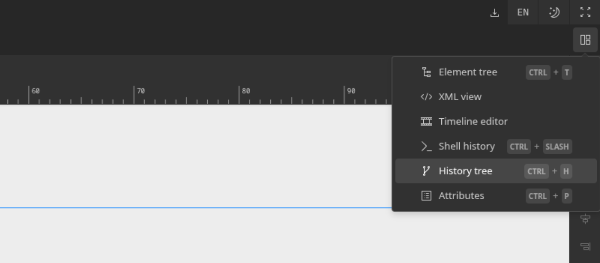
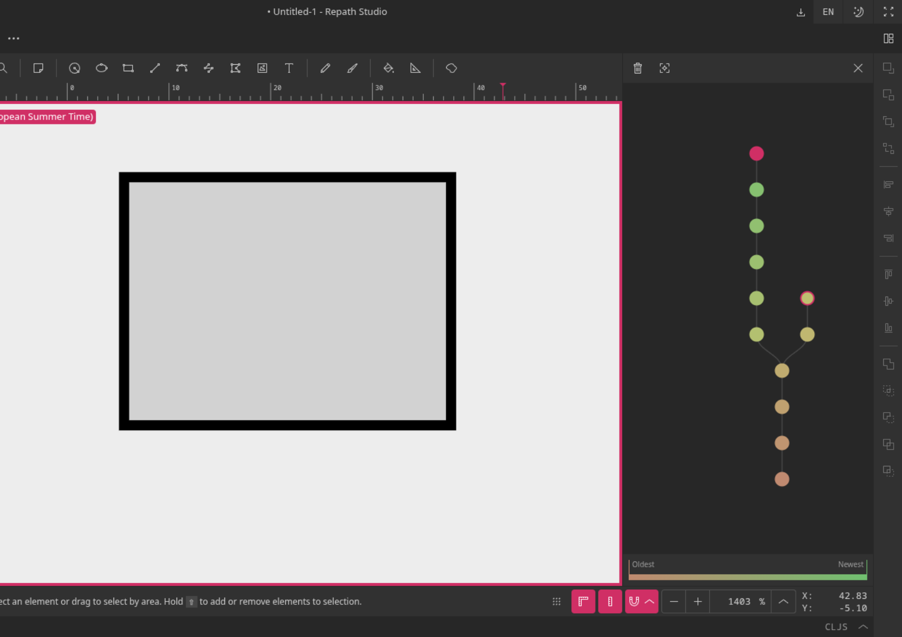

# History tree

An advanced undo/redo mechanism is implemented to maintain a full history tree of actions
in memory, so users will never lose their redo stack. You can enable the history view using
our panel dropdown.

The currently active state is the pink colored circle. For the rest, a dynamic color is
picked from light brown to light green gradient, that represents the age of the action, from
the oldest to the newest. Moving your mouse over a tree node will preview the state of the
canvas. Clicking on it would travel to this point of history. You can use the buttons at the
top of the tree view to clear the history or center the view.

If all that this seems to complicated, simply using the undo/redo action will behave the way
you would expect.
