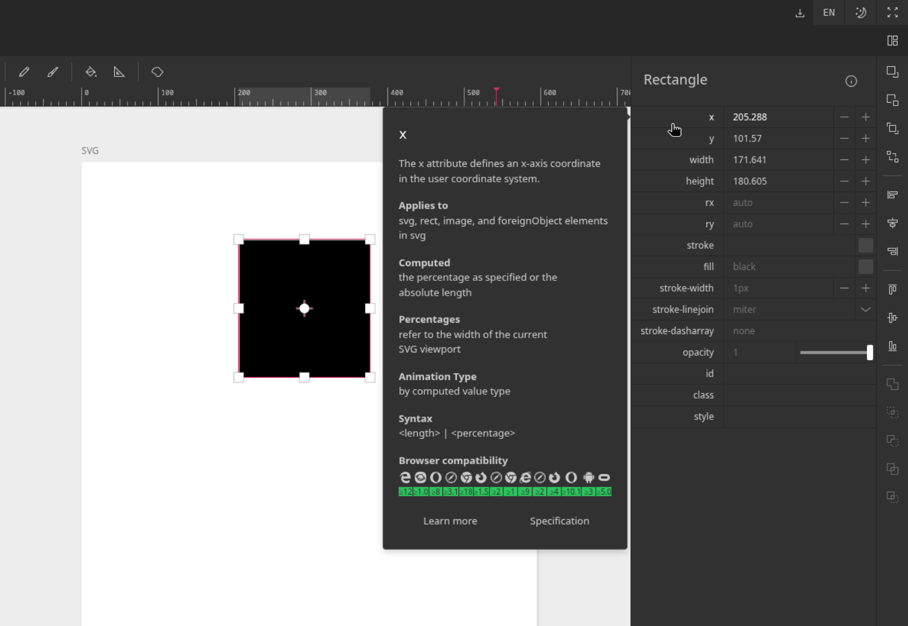

# Powered by the SVG specification

This project relies heavily on the SVG specification, and tries to educate users about it.
The specification info is based on

- [MDN data](https://github.com/mdn/data) - A repository that contains general data
  for Web technologies and is maintained by the MDN team at Mozilla.
- [BCD](https://github.com/mdn/browser-compat-data) - The `browser-compat-data` ("BCD")
  project that contains machine-readable browser compatibility data for Web technologies,
  such as Web APIs, JavaScript features, CSS properties and more.

Updates on those projects may affect the behavior of the application.

The attributes of SVG elements and their default values are based on the specification
itself. For example, the default fill value of a rectangle is `black`, so if there is no
custom value set the rect will be rendered black. The editor is aware of the spec, and
displays the default value as a grayed out placeholder on the inputs.

Hovering your mouse over the attribute name displays a popover with additional information
about the attribute. The `Learn more` button at the bottom navigates to the [MDN](https://developer.mozilla.org/)
page of the attribute, and the `Specification` button to the corresponding [W3C](https://www.w3.org/)
page.

The input of the attribute accepts any string. The editor will not attempt to validate it,
but it will try to preserve its unit, if you modify it indirectly. For instance, if can set
the value of `x` of the a rect element  to `24rem`, and then move the element using your mouse,
the updated value will retain the `rem` unit.

Some attributes may also render a controller next to the input, like the color picker of fill,
that helps setting a value.
