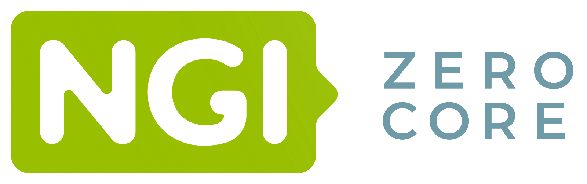

- :fontawesome-solid-code-branch:{ .lg .middle } __History tree__

    ---

    { width="100%" }

    Maintain all user actions and travel through time, without ever losing your undo/redo
    stack.

    [Read more](/get-started/history-tree)

- :fontawesome-solid-terminal:{ .lg .middle } __Interactive shell__

    ---

    { width="100%" }

    Evaluate Clojure, Python, and JavaScript code on the embedded
    REPL to generate shapes, or even extend the editor on the fly.

    [Read more](/get-started/interactive-shell)

- :material-animation-play:{ .lg .middle } __SMIL animations__

    ---

    { width="100%" }

    Create and edit SMIL animations, an extension of SVG allowing to animating SVG elements.

- :simple-svg:{ .lg .middle } __Powered by SVG__

    ---

    Educational-driven exposing the specification and rendering on an
    SVG canvas.

- :material-human:{ .lg .middle } __Accessibility testing__

    ---

    Built-in tools that help you evaluate the accessibility of your creations.

- :material-source-commit:{ .lg .middle } __Open Source__

    ---

    Distributed under the terms of the AGPL-3.0 license.

    [Read more](/policies/license)

<section>
    <h2 style="text-align: center;">Supported by NLnet</h2>
    

        This project was funded through
        <a href="https://nlnet.nl/commonsfund">NGI0 Commons Fund</a>, a fund established
        by <a href="https://nlnet.nl/">NLnet</a> with financial support from the European
        Commission's <a href="https://ngi.eu/">Next Generation Internet</a> programme.
    

    

        
        
    

</section>
